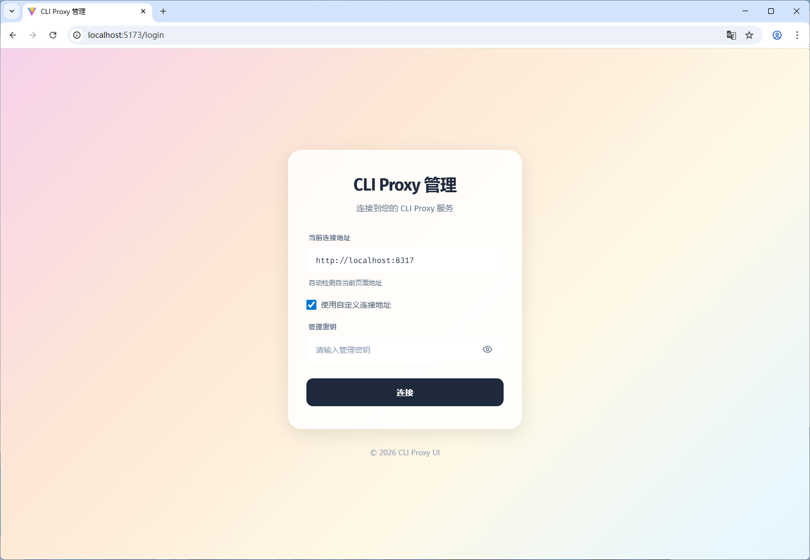
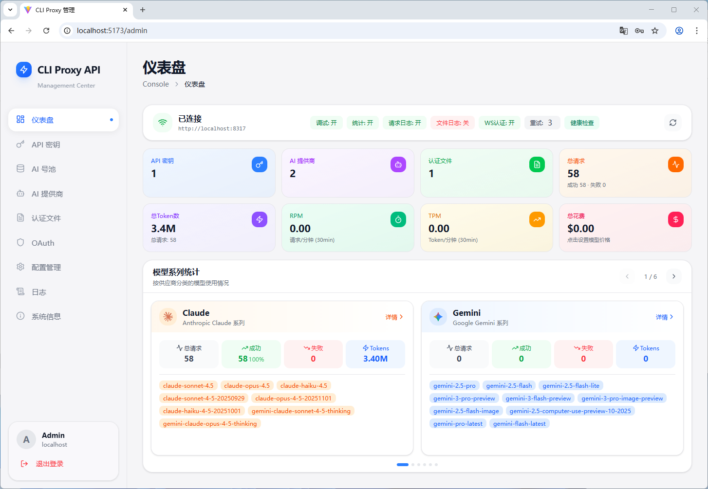
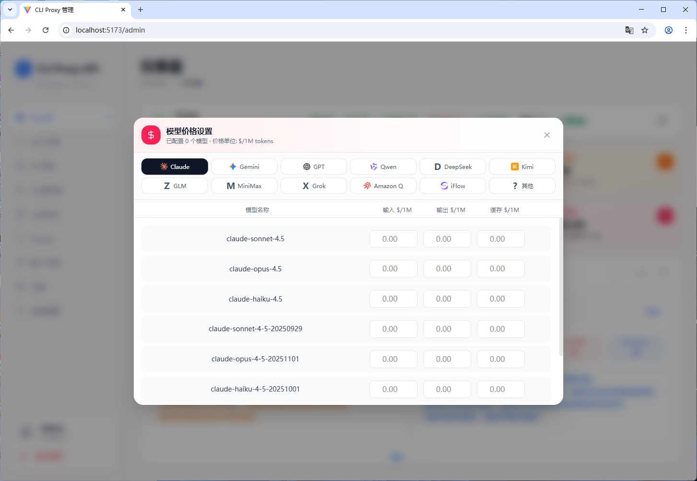
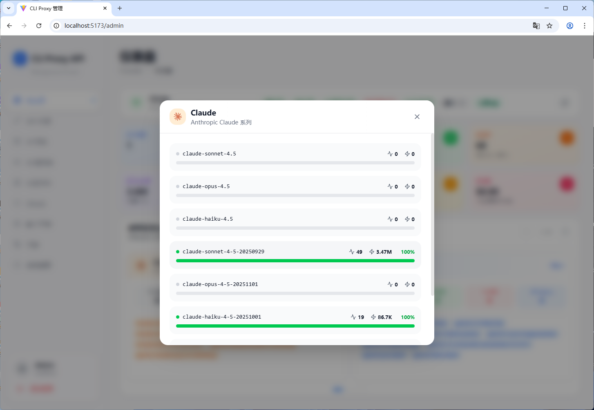
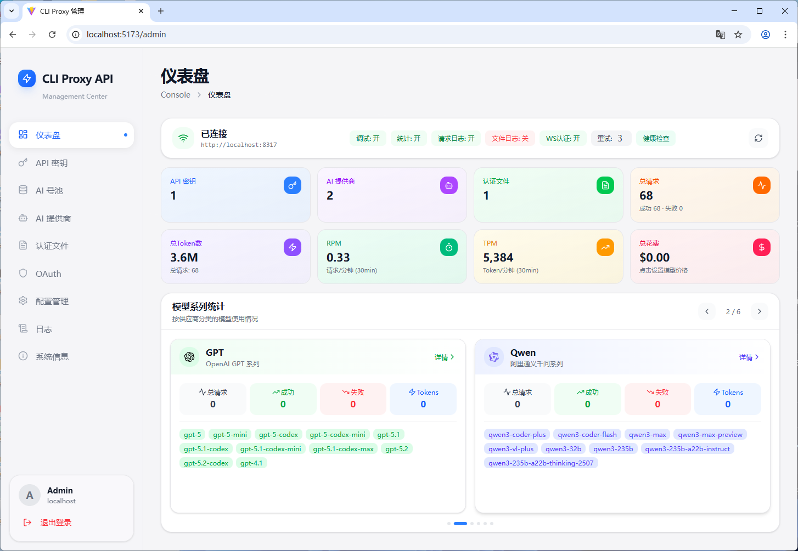
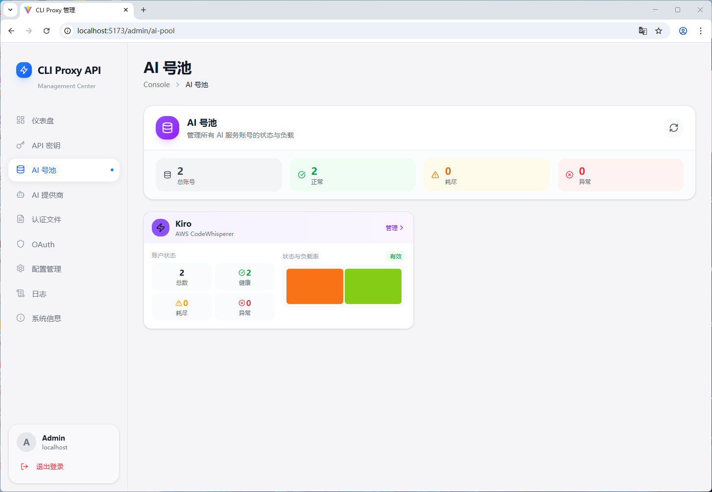
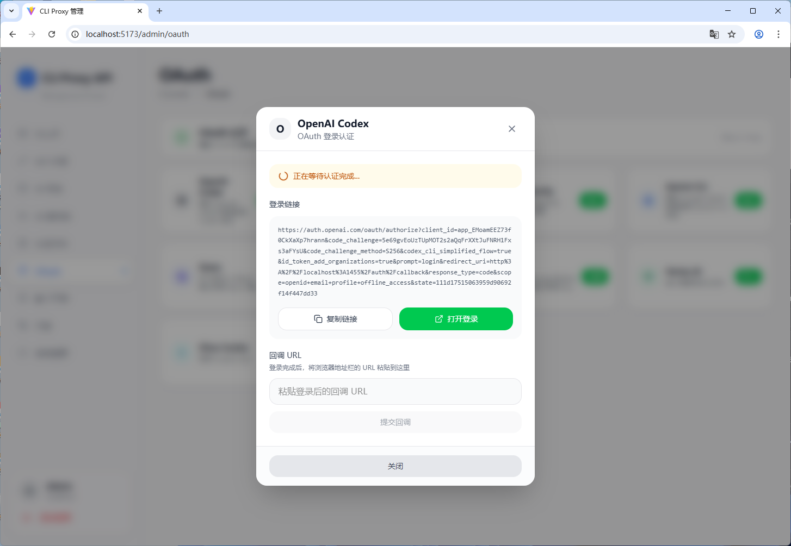

# CLI Proxy UI

CLI Proxy 管理后台前端，基于 React 19 + TypeScript + Tailwind CSS 构建。

## 效果预览

### 仪表盘


### AI 提供商


### AI 号池


### OAuth 认证


### 配置管理


### 日志


### 系统配置


## 技术栈

- React 19 + TypeScript
- Vite 7
- Tailwind CSS 4
- Zustand (状态管理)
- React Router 7
- Lucide React (图标)
- CodeMirror (YAML 编辑器)

## 功能模块

- **仪表盘** - 统计概览、使用量图表、模型分布
- **API 密钥** - 管理 API 访问密钥
- **AI 号池** - 管理 AI 账号池状态
- **AI 提供商** - 配置 Gemini、Claude、Codex、OpenAI 兼容、Kiro、Ampcode 等
- **认证文件** - 管理 OAuth 认证文件
- **OAuth** - OAuth 登录认证（支持多平台）
- **配置管理** - YAML 配置文件编辑
- **日志** - 查看系统日志
- **系统配置** - 代理、配额、日志、安全等系统设置

## 开发

```bash
# 安装依赖
npm install

# 启动开发服务器
npm run dev

# 构建生产版本
npm run build

# 预览生产构建
npm run preview
```

## 目录结构

```
src/
├── assets/          # 静态资源（图标等）
├── components/      # 通用组件
│   ├── layout/      # 布局组件
│   └── ui/          # UI 基础组件
├── pages/           # 页面组件
│   ├── dashboard/   # 仪表盘
│   ├── api-keys/    # API 密钥
│   ├── ai-pool/     # AI 号池
│   ├── ai-providers/# AI 提供商
│   ├── auth-files/  # 认证文件
│   ├── oauth/       # OAuth 认证
│   ├── config/      # 配置管理
│   ├── logs/        # 日志
│   └── system/      # 系统配置
├── services/        # API 服务
├── stores/          # Zustand 状态管理
├── utils/           # 工具函数
├── App.tsx          # 应用入口
└── main.tsx         # 渲染入口
```

## 环境要求

- Node.js >= 18
- npm >= 9

## License

MIT
